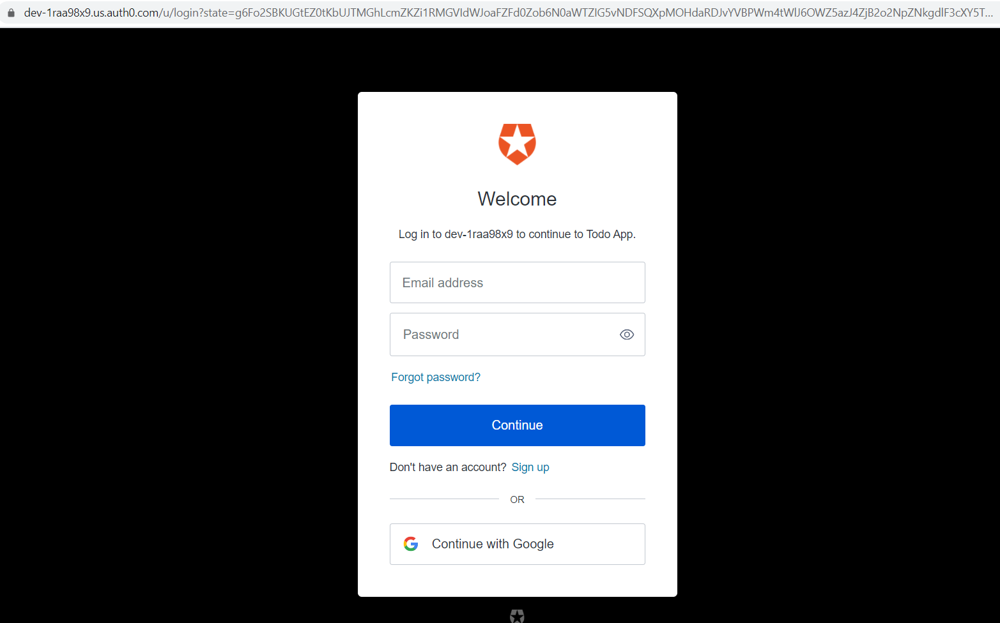
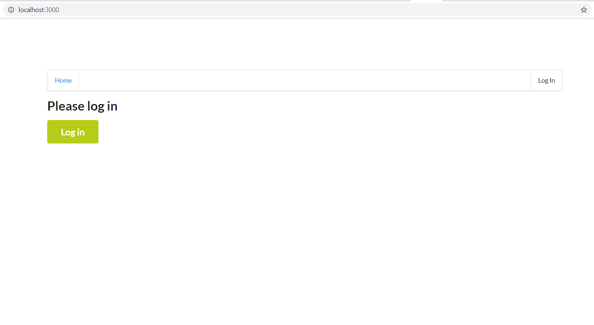
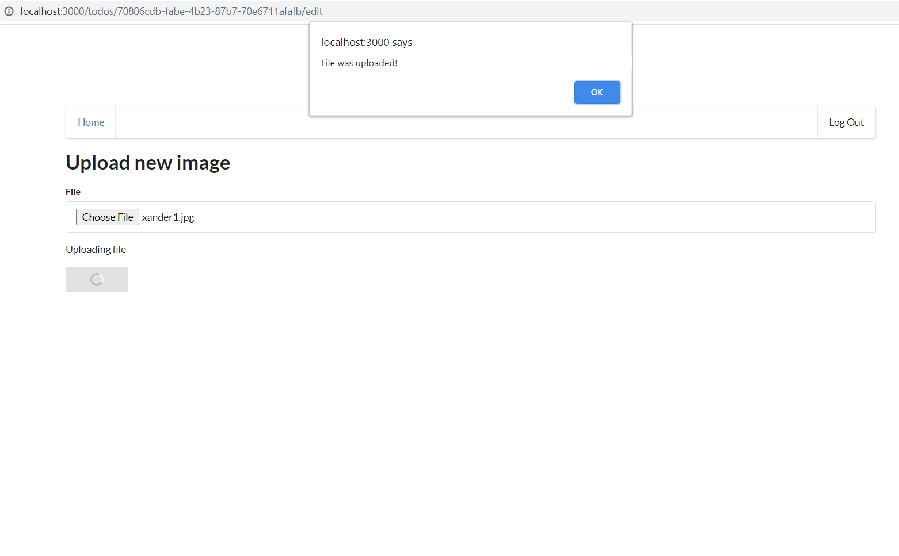
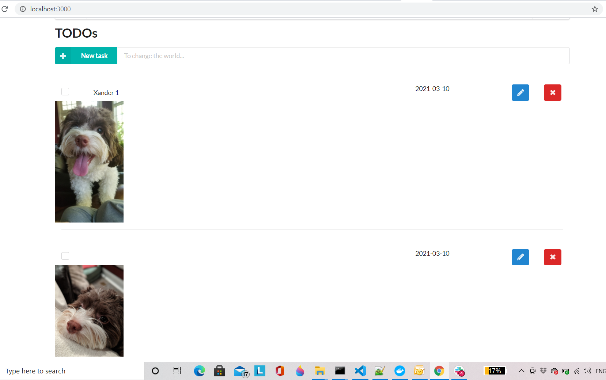

# Serverless TODO

This project demonstrates the setup of application components as a serverless application running on a Cloud Infrastructure

# Functionality of the application

This application will allow creating/removing/updating/fetching TODO items. Each TODO item can optionally have an attachment image. Each user only has access to TODO items that he/she has created.


# How to run the application

## Backend

To deploy an application run the following commands:

```
cd backend
npm install
sls deploy -v
```

## Frontend

To run a client application first edit the `client/src/config.ts` file to set correct parameters. And then run the following commands:

```
cd client
npm install
npm run start
```

This should start a development server with the React application that will interact with the serverless TODO application.

# Screen Shots

An alternative way to test your API, you can use the Postman collection that contains sample requests. You can find a Postman collection in this project. To import this collection, do the following.

Select google id




After successful login




Select a file for upload




Image list



